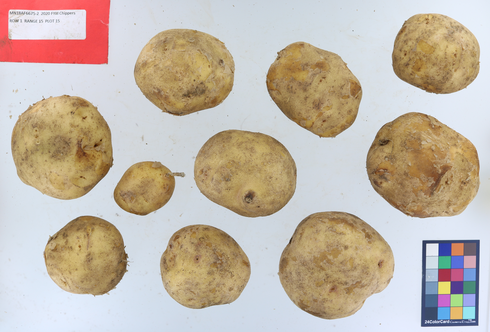

# Abstract

TubAR (Tuber Analysis in R) provides potato researchers with a simple means of quantitative phenotyping replacing previously used imprecise qualitative scales. Users collect images of sample tubers using a light box, and then use the package to quantify: tuber length, width, roundness, skinning percentage, redness, and lightness. Finally, the data is prepared for export and use in mapping, genomic selection, etc.

# Installing the package

Use the `install_github` function from the devtools package to install TubAR.
TubAR makes use of the EBImage and Biobase packages, which are available through BiocManager, not CRAN, so you will also have to install those packages before TubAR.
```{r, include=T, eval=F}
install.packages("devtools")
install.packages("BiocManager")
BiocManager::install("EBImage")
BiocManager::install("Biobase")
devtools::install_github("michaelmiller45/TubAR")
```

# Collecting Image Data

TubAR is designed for use with a Photosimile 200 lightbox, however other lightboxes with approximately a 60cm by 60cm base should be compatible. The authors used a Canon Rebel T6i camera using a 24mm lens, ISO 100, 1/30 sec shutter speed and aperture f/5.6 to take photos. Potatoes should be washed and dried before imaging for accurate results. TubAR is intended for evaluating up to 10 tubers per photo. With large potatoes, fewer tubers per photo may be necessary to avoid contact between tubers. All tubers in one photo should be the same clone. A 24ColorCard 2x3 from CameraTrax should be included in a corner of the camera view for color correction (This specific color card is necessary to ensure proper color correction). Ensure this card remains straight, with the text at the bottom of the card, as shown in example pictures. If the card is crooked, this may hinder color correction. You may find it helpful to include a tag that identifies the pictured clone. Bright red or bright green, 8cm by 12cm rectangular tags are recommended for reliable removal of tags from data. Setting the tag in the upper left corner with no space between the tag and the edge of the picture is ideal. Input images should be in a JPEG format. Image file names should be chosen so that it is easy to identify the clone pictured without having to open and look at the photo. The zoom and camera placement should remain consistent for all samples that are to be compared. See Caraza‐Harter & Endelman (2020) for further information on set up.



# Example Walkthrough

We will show the data collection and organization workflow using an example data set of 11 photos. 

Photos were taken using the previously described means. Photos are housed in a single file that was then set as the working directory.
```{r setwd, include=T, eval=F}
library(TubAR)
setwd("./inst/images")
```

The `shape.all()` and `skin.all()` functions were used to create the `shape_exmp` and `skin_exmp` data. `skin.all()` will likely take several minutes.  

```{r process images, include=T, eval=F}
shape_exmp <- shape.all(n.core=1)
skin_exmp <- skin.all(n.core=1, display=T, mode="debug", write.clean=F, pix.min=4e3, scaledown=4, colorcard="bottomright")
```

```{r load examples, include=F}
load(file = "./inst/example_data/shape_exmp.rds")
load(file = "./inst/example_data/skin_exmp.rds")
source("./R/export.R")
library(Biobase)
```

The `shape.all()` output `shape_exmp` is formatted as an array with a row for each potato. Each row lists the image the potato is from along with the measurements for each trait. No median value per image is given in this data form.

The `skin.all()` output `skin_exmp` is formatted as a list with two elements `median.values` and `by.tuber`. `median.values` is an array of the median values for each trait for each photo. `by.tuber`consists of sublists for each image which contain lists of individual tuber values for each trait.

Below are small portions of the data to show how the data is formatted at this stage.  
```{r data output types, include=T}
shape_exmp[1:2,]
skin_exmp$median.values
skin_exmp$by.tuber[1]
```

In order to summarize and better format the data for export to other programs or packages, as well as remove tags, one more step is required, using the `skin.export()` and `shape.export()` functions.

```{r export examples, include=T, warning=F}
setwd("./inst/images")
shape.export(shape_exmp, remove_tag=T)
skin.export(skin_exmp, remove_tag=T)
```
These functions give two matrices of the median values of each trait for each image. In order to ensure these functions work correctly the working directory should be set to the same folder the images are in.

Writing a csv file of median trait values is often a simple way of preparing the output data for use in other programs and databases. If this is desired, the `write.csv` function can create a csv file for each matrix in the current working directory. 

```{r writning csv, eval=F}
write.csv(shape_exmp, file= "shape_exmp.csv", quote = FALSE)
write.csv(skin_exmp, file= "skin_exmp.csv", quote = FALSE)
```

# Functions Overview
TubAR trait measurement is divided between two groups of functions: shape and skin functions. Shape functions measure traits using the shape and dimensions of the potato perimeter while skin functions measure traits using the color of the potato surface. 

## Shape Fuctions

TubAR can measure potato shape in eight ways using `find.shape()`. Multiple photos can be processed as a batch by using `shape.all()`.

### Function Inputs and Arguments

`find.shape()` takes an input JPEG image as well as several arguments to optimize speed and ensure potatoes are separated from the colorcard and debris.

* `pix min =` Sets the minimum pixel size of an object to not be removed with the background. This helps to remove dirt, flaked skin, or other debris that the function might otherwise attempt to measure as a potato. By default, this is set at !!!4e3!!!. If the function is measuring too many shapes per photo this can be increased (An order of magnitude increase is reasonable in trying to calibrate this). On the other hand, if small potatoes are being excluded the number can be lowered.

* `scaledown =` Sets the degree by which the image will be reduced in size to speed up processing. By default this is 8. Increasing the number will potentially speed up processing, however loss of detail will eventually lead to inaccurate measurements or errors.

* `colorcard =` Lists which corner the colorcard is positioned in. This is set to "bottomright" by default. "bottomleft", "topright", and "topleft" are the other settings.

If processing many photos, `shape.all()` will process all photos in the working directory. Keep the number of photos in the directory folder below 30 photos when using RStudio to avoid errors from sending too much data into the function. Running R in the command line can allow for larger photo batches.

* `n.core =` : Determines the number of processor cores to use in the function. This is set to 1 by default. This setting is going to depend on your computer and is usually limited if running R through RStudio.

### Trait outputs

* Bounding box width and height
    : This is the width and length of the smallest rectangle that could contain the whole tuber.
    
* Perimeter
    : This is the length of the outer edge of the tuber. Cracks and other deformities can potentially skew this number.

* Convex perimeter
    : This is the length of the perimeter if the entire tuber shape followed a convex curve, as a circle or ellipse does. This can correct for increases in perimeter caused by cracks and deformities.

* Area
    : This is the area contained in the perimeter. Cracks and other factors could subtract from this number

* Convex hull area
    : This is the area contained with in the convex perimeter.

* Compactness
    : This is a measure of how much the potato shape resembles a perfect circle based on the perimeter and area.

* Roundness
    : This is a measure of how much the potato shape resembles a perfect circle based on the convex perimeter and convex hull area.

* Maximum length
    : This is the greatest Euclidean distance between two points on the tuber. This is often a diagonal line across the tuber.

## Skin Functions

TubAR measures three traits through the `find.skin()` function. Multiple photos can be processed as a batch by using `skin.all()`.

### Function Inputs and Arguments

* `display =` : This determines whether R wil output an image with grayscale objects. This can be useful for ensuring all potatoes are being detected while debris is removed and for visualization of the analysis process. by default this is set to TRUE.

* `mode =` : If this is set to "debug" the display will show numbered objects and skinned area on the objects.

* `write.clean=` : If set to TRUE, an image of the potatoes with the background removed will be created, which may be wanted for situations such as presentations. This is set to FALSE by default.

* `pix min =` Sets the minimum pixel size of an object to not be removed with the background. This helps to remove dirt, flaked skin, or other debris that the function might otherwise attempt to measure as a potato. By default, this is set at 4000. If the function is measuring too many shapes per photo this can be increased (An order of magnitude increase is reasonable in trying to callibrate this). On the other hand, if small potatoes are being excluded the number can be lowered.

* `scaledown =` Sets the degree by which the image will be reduced in size to speed up processing. By default this is 4. Increasing the number will potentially speed up processing, however loss of detail will eventually lead to inaccurate measurements or errors.

* `colorcard =` Lists which corner the colorcard is positioned in. This is set to "bottomright" by default. "bottomleft", "topright", and "topleft" are the other settings. If color correction causes errors or otherwise is not desired, this can be set to F to skip this step. Skipping this step will likely decrease the accuracy of the skin data and is not recommended.

* `color.correct =` : This determines whether color correction will be preformed. This is set to TRUE by default 

* `n.core =` : Determines the number of processor cores to use in the function. This is set to 1 by default. This setting is going to depend on your computer and is usually limited if running R through RStudio.

### Trait Outputs

* Skinning
    : This is an estimate of the percentage of skinned surface area of the tuber.

* Redness
    : This is the average level of redness, as defined by the CIELAB colorspace, of the unskinned portion of the tuber.
    
* Lightness
    : This is the average level of lightness, as defined by the CIELAB colorspace, of the unskinned portion of the tuber.

## Exporting Data
The export functions `skin.export()` and `shape.export()` create a matrix of median values for each trait for each picture. this matrix is meant to be easy to turn into a csv or other file or to pass into other functions and programs.
This function uses the name of the image file to identify clones in a picture so it is recommended that pictures be given names that can be easily tied back to a particular clone.

### Tag Removal
If a tag is included in the photo, it can be removed at the data export stage. Tag removal is turned off by default to avoid unintended removal of true potatoes. `skin.export(data, remove_tag=T)` and `shape.export(data, remove_tag=T)` can be used to include tag removal in the exporting process. The way tag removal is accomplished in each fuction is different and affects how each function can be utilized. `export.skin(remove_tag=T)` removes data that is outside of a range of redness values. The thresholds of this range should be set at values that are inclusive of the redness values of any potatoes but where the tags would be excluded. Because redness is being used as the threshold, bright red or bright green tags work best to ensure these threshold values exist. By default, the green threshold is set at -5 and the red threshold is set at 50. These can be adjusted using the arguments `green_thresh` and `red_thresh`.
`export.shape(remove_tag=T)` removes data from objects below a certain roundness threshold. This is generally a more wide ranging way to distinguish tags from potatoes and any square or rectangular tags should be excluded through this function. By default, the roundness threshold is set at 0.7. This can be adjusted using the argument `roundness_thresh`.

# References

### Further Reading
Caraza‐Harter, M. V., & Endelman, J. B. (2020). 
  Image‐based phenotyping and genetic analysis of potato skin set and color. 
  Crop Science, 60(1), 202-210.

### Code Utilized
Donald Danforth Plant Science Center. (2020).
  Tutorial: Morphology Functions. Plantcv.
  https://plantcv.readthedocs.io/en/stable/morphology_tutorial/
  
Wollschlaeger, D., (2019). Convex hull, (minimum) bounding box, and minimum   
  enclosing circle. http://dwoll.de/rexrepos/posts/diagBounding.html.

### Package Imports
Bivand, R.S., Pebesma, E., Gomez-Rubio, V., 2013. Applied
  spatial data analysis with R, Second edition. Springer, NY.
  https://asdar-book.org/  
  
Elzhov, T.V, Mullen, K.M, Spiess, A.N., and Bolker, B. (2016). 
  minpack.lm: R Interface to the Levenberg-Marquardt
  Nonlinear Least-Squares Algorithm Found in MINPACK, Plus Support for
  Bounds. R package version 1.2-1, https://CRAN.R-project.org/package=minpack.lm

Pau, G., Fuchs, F., Sklyar, O., Boutros, M., and Huber, W, (2010): 
  EBImage - an R   package for image processing withapplications to cellular  
  phenotypes. Bioinformatics, 26(7), pp. 979-981,
  10.1093/bioinformatics/btq046.
  
Pebesma, E.J., R.S. Bivand, 2005. Classes and methods for spatial data in
  R. R News 5 (2), https://cran.r-project.org/doc/Rnews/.
  
R Core Team (2018). R: A language and environment for statistical computing. R 
  Foundation for Statistical Computing, Vienna, Austria. URL 
  https://www.R-project.org/.

Schlager S (2017). “Morpho and Rvcg - Shape Analysis in R.” In Zheng G, Li
  S, Szekely G (eds.), _Statistical Shape and Deformation Analysis_, 217-256.
  Academic Press. ISBN 9780128104934.
  
  
